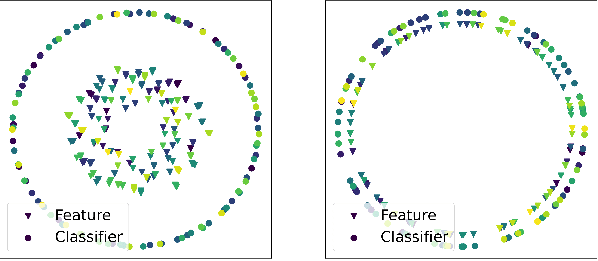

# Neural Collapse with Normalized Features: A Geometric Analysis over the Riemannian Manifold

Experiment code for our accepted NeurIPS '22 paper [[arXiv]](https://arxiv.org/abs/2209.09211). 

To train a general model, use `train.py` with the desired options (see ``--help``). Model weights will be saved periodically in `{save_dir}/{experiment_name}`, along with a configuration file, as well as train and (optionally) test metrics.

To reproduce experiments (using deep networks) found in the paper, look in the `experiments` folder. Figure generation code and non-neural network experiment code may be added in the future.
